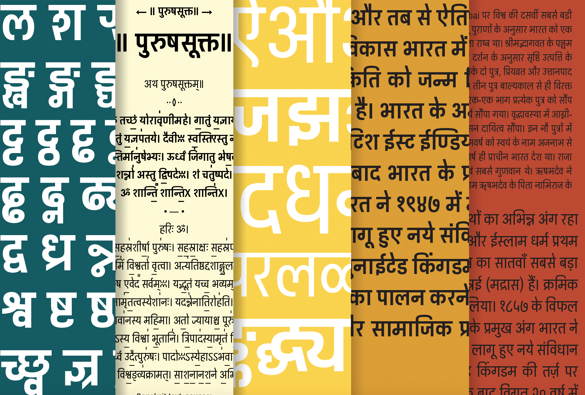

# Pragati Narrow (Archivo Narrow-Devanagari)  
###(*Release Candidate*)

**Omnibus-Type**  
*SIL Open Font License, 1.1*

Pragati Narrow, the Devanagari typeface family designed as a complement of Archivo Narrow.

Pragati Narrow is a libre Devanagari typeface family designed as a complement to [Archivo Narrow](https://www.google.com/url?q=https%3A%2F%2Fwww.google.com%2Ffonts%2Fspecimen%2FArchivo%2BNarrow)*. Pragati Narrow is a sans-serif family with vertical and horizontal cuts designed by Marcela Romero, Pablo Cosgaya and Nicolás Silva. It comes in 2 weights (Regular and Bold) and was specially developed for screen as webfont and desktop font, too. The Latin version of Pragati is reminiscent of late nineteenth century American typefaces. It includes four Narrow styles and four Normal styles (in development), was derived from Chivo (designed by Héctor Gatti) and was developed with the collaboration of the [Omnibus-Type](http://www.google.com/url?q=http%3A%2F%2Fomnibus-type.com%2F&sa=D&sntz=1&usg=AFQjCNEK1dbRyWJN56zeP8EaPCup9kDYQw) team. 

\* Pragati (प्रगति) is the Hindi word for ‘progress’. 

**Features support**
- `ccmp`
- `locl`
- `sups`
- `frac`
- `ordn`
- `ss02`
- `nukt`
- `akhn`
- `rphf`
- `rkrf`
- `blwf`
- `half`
- `cjct`
- `abvs`
- `pres`

To contribute to the project contact [Omnibus Type](http://omnibus-type.com/).

### Designers

* **Latin** Hector Gatti
* **Devanagari** Marcela Romero, Pablo Cosgaya and Nicolas Silva

### License

Copyright (c) 2012-2015, Omnibus-Type (www.omnibus-type.com omnibus.type@gmail.com)

Licensed under the [*SIL Open Font License, 1.1*](http://scripts.sil.org/OFL); you may not use this file except in compliance with the License.

### Devanagari Unicode Character Map

*uni*|090   |091|092|093|094 |095	|096	|097
-----|------|---|---|---|----|------|-------|-----
**0**| ◌ऀ	| ऐ	| ठ	| र	| ◌ी | ॐ	| ॠ		|	॰
**1**| ◌ँ	| ऑ	| ड	| ऱ	| ◌ु	 | ◌॑	| ॡ		|	ॱ
**2**| ◌ं	| ऒ	| ढ	| ल	| ◌ू	 | ◌॒	| ◌ॢ		|	ॲ
**3**| ◌ः	| ओ	| ण	| ळ	| ◌ृ	 | ◌॓	| ◌ॣ		|	ॳ
**4**| ऄ	| औ	| त	| ऴ	| ◌ॄ	 | ◌॔	| ।		|	ॴ
**5**| अ	| क	| थ	| व	| ◌ॅ	 | ◌ॕ	| ॥		|	ॵ
**6**| आ	| ख	| द	| श	| ◌ॆ	 | ◌ॖ	| ०		|	ॶ
**7**| इ	| ग	| ध	| ष	| ◌े	 | ◌ॗ	| १		|	ॷ
**8**| ई	| घ	| न	| स	| ◌ै	 | क़	| २		|	ॸ
**9**| उ	| ङ	| ऩ	| ह	| ◌ॉ	 | ख़	| ३		|	ॹ
**A**| ऊ	| च	| प	| ◌ऺ	| ◌ॊ	 | ग़	| ४		|	ॺ
**B**| ऋ	| छ	| फ	| ◌ऻ	| ◌ो	 | ज़	| ५		|	ॻ
**C**| ऌ 	| ज	| ब	| ◌़	| ◌ौ	 | ड़	| ६		|	ॼ
**D**| ऍ		| झ	| भ	| ऽ	| ◌्	 | ढ़	| ७		|	ॽ
**E**| ऎ		| ञ	| म	| ◌ा	| ॎ◌	 | फ़	| ८		|	ॾ
**F**| ए		| ट	| य	| ि◌	| ◌ॏ	 | य़	| ९		|	ॿ

### Devanagari Extended Unicode Character Map

*uni*|A8E   |A8F
-----|------|---
**0**| ◌꣠	| ◌꣰	
**1**| ◌꣡	| ◌꣱	
**2**| ◌꣢	| ꣲ	
**3**| ◌꣣	| ꣳ	
**4**| ◌꣤	| ꣴ	
**5**| ◌꣥	| ꣵ	
**6**| ◌꣦	| ꣶ	
**7**| ◌꣧	| ꣷ	
**8**| ◌꣨	| ꣸	
**9**| ◌꣩	| ꣹	
**A**| ◌꣪	| ꣺	
**B**| ◌꣫	| ꣻ	
**C**| ◌꣬	| --
**D**| ◌꣭	| --
**E**| ◌꣮	| --
**F**| ◌꣯	| --

======
## FONTLOG for the Archivo Narrow fonts

This file provides detailed information on the Archivo Narrow Font Software.  
This information should be distributed along with the Archivo fonts and any derivative works.

### Archivo is a typeface family that supports Unicode language range: 

* Devanagari (618 glyphs)
* Basic Latin (95 glyphs),
* Latin-1 Supplement (96 glyphs),
* Latin Extended-A (128 glyphs),
* Latin Extended-B (7 glyphs),
* Spacing Modifier Letters (9 glyphs),
* Latin Extended Additional (8 glyphs),
* General Punctuation (23 glyphs),
* Superscripts and Subscripts (1 glyphs),
* Currency Symbols (4 glyphs),
* Letterlike Symbols (6 glyphs),
* Number Forms (4 glyphs),
* Arrows (7 glyphs),
* Mathematical Operators (17 glyphs),
* Miscellaneous Technical (4 glyphs),
* Alphabetic Presentation Forms (2 glyphs)

*To contribute to the project contact Omnibus-Type at omnibus.type@gmail.com*

**6 April 2015 (Omnibus Type) Pragati Narrow Release Candidate v1.007**
- New ueMatra anchors
- Fixed linked anchors in nukta instances
- Inserted 'lookupflag IgnoreMarks' in pres
- Separated oeMatra from the shoulder
- Fixed Rakar before halant (Half Vattu Nukta)

**25 February 2015 (Omnibus Type) Pragati Narrow Release Candidate v1.006**
- Fixed issue with nukta next to halant
- Matched size of the Devanagari letters with Ek Mukta
- Improved conections between iMatras with reph and the stem of the last consonant in a cluster

**28 January 2015 (Omnibus Type) Pragati Narrow Beta v1.005**  
- Name tables adjusted
- fsType Installable Mode
- Set Panose values
- Updates CFF and TTF hinting
- Added Family Alignment Zones

**January 27, 2015 (Omnibus Type) Pragati Narrow Beta v1.005 (*release candidate*)**
- Massive update in the design of the glyphs and expanded conjuncts

**December 3, 2014 (Omnibus Type) Pragati Narrow Beta v1.004 (*release candidate*)**
- Enhance mark suport in all dev2 and deva OT features (via Glyphs 2)
- Expanded precompound marks ang conjuncts

**October 7, 2014 (Omnibus Type) Archivo Narrow Devanagari v1.004 (*first release updated*)**
- Suporte all dev2 and deva OT features (via Glyphs 2)
- Improved the balance beetween Latin and Devanagari
- Less latinized glyphs like इ ड and all the derivated glyphs
- Enhance legibility on conjunction
- Incremented the height of Matras
- Cleaned OT Features
- TableName windows compatible
- Updated TTF Autohinting (v1.1): `-r 72 -c -i -x 0 -D deva -f none -W -w gGD`

**August 29, 2014 (Omnibus Type) Archivo Narrow Devanagari v1.004 (*first release*)**
- Suporte all dev2 OT features (via FDK)
- New Devanagari glyphs (range: 0900-097F and A8E0-A8FF)
- Update hinted

**June 23, 2013 (Omnibus Type) Archivo Narrow v1.003**
- Fixed Name Table (Thanks to Dave Crossland @davelab6 for his technical input.)
- Updated hinting with ttfautohint (v0.95) with the follow values: `ttfautohint -l 8 -r 50 -G 200 -x 14 -w "G" -W [IN-FILE [OUT-FILE]]`

**October 2, 2012 (Omnibus Type) Archivo Narrow v1.002**
- Fixed encoding Tables and index (Thanks to Theunis de Jong for his technical input.)
- Fixed TTF Naming Tables

**August 22, 2012 (Omnibus Type) Archivo Narrow v1.002**
- Initial release under SIL Open Font License

### Acknowledgements

If you make modifications be sure to add your name (N), email (E), web-address
(if you have one) (W) and description (D). This list is in alphabetical order.

**N:** **Hector Gatti**  
**E:** omnibus.type@gmail.com  
**W:** http://www.omnibus-type.com  
**D:** Designer of Latin version

**N:** **Marcela Romero**  
**E:** omnibus.type@gmail.com  
**W:** http://www.omnibus-type.com  
**D:** Designer of Devanagari version

**N:** **Nicolas Silva**  
**E:** omnibus.type@gmail.com  
**W:** http://www.omnibus-type.com  
**D:** Font Production/ Designer of Devanagari version

**N:** **Pablo Cosgaya**  
**E:** omnibus.type@gmail.com  
**W:** http://www.omnibus-type.com  
**D:** Designer of Devanagari version
